# Database schema — ER diagram (updated 2026-06-15)

Generated from `prisma/schema.prisma` (40 models). Vector diagram — renders crisp
at any zoom. **To view at high resolution:**
- **GitHub** renders the Mermaid block below natively (open this file on GitHub).
- **VS Code**: install the *"Markdown Preview Mermaid Support"* extension, then open
  this file and hit the preview button (top-right).
- **Export PNG/SVG**: paste the ` ```mermaid ``` ` block into <https://mermaid.live>
  and use *Actions → PNG/SVG* for a print-resolution image.

Cardinality legend: `||` exactly one · `|o` zero-or-one · `o{` zero-or-many · `}o--o{` many-to-many.

```mermaid
erDiagram
    %% ───────────────────────── Tenancy / auth ─────────────────────────
    Team {
        string id PK
        string name
        Plan plan
    }
    User {
        string id PK
        string teamId FK
        Role role
        string email
        string name
    }
    ChannelConnection {
        string id PK
        string teamId FK
        Channel channel
        json config
        json secrets
        bool isActive
    }
    Session { string id PK }
    Account { string id PK }
    Verification { string id PK }
    LoginAttempt { string id PK }

    Team ||--o{ User : "members"
    Team ||--o{ ChannelConnection : "connections"
    User ||--o{ Session : ""
    User ||--o{ Account : ""

    %% ───────────────────────── Contacts ─────────────────────────
    Contact {
        string id PK
        string teamId FK
        string phoneNumber
        Channel identityChannel
        string externalContactId
        string stageId FK
        ContactSource source
        int version
        datetime deletedAt
    }
    ContactStage {
        string id PK
        string teamId FK
        string name
        int order
    }
    ContactFieldDefinition {
        string id PK
        string teamId FK
        string key
    }
    Tag {
        string id PK
        string teamId FK
        string name
        string color
    }
    AudienceGroup {
        string id PK
        string teamId FK
    }

    Team ||--o{ Contact : ""
    Team ||--o{ ContactStage : ""
    Team ||--o{ ContactFieldDefinition : ""
    Team ||--o{ Tag : ""
    Team ||--o{ AudienceGroup : ""
    ContactStage |o--o{ Contact : "stage"
    Contact }o--o{ Tag : "tagged"
    AudienceGroup }o--o{ Tag : "filter"
    AudienceGroup }o--o{ Contact : "members"
    User |o--o{ AudienceGroup : "created"

    %% ───────────────────────── Inbox (conversations / messages) ─────────────────────────
    Conversation {
        string id PK
        string teamId FK
        string contactId FK
        Channel channel
        ConversationStatus status
        string assignedUserId FK
        int unreadCount
    }
    Message {
        string id PK
        string teamId FK
        string conversationId FK
        string externalId
        MessageDirection direction
        Channel channel
        MessageStatus status
        string senderUserId FK
        string replyToMessageId FK
        json rawPayload
    }
    InternalNote {
        string id PK
        string teamId FK
        string conversationId FK
    }
    ConversationEvent {
        string id PK
        ConversationEventKind kind
    }
    OutboundSendAttempt {
        string id PK
        string jobId
        string externalId
    }

    Team ||--o{ Conversation : ""
    Team ||--o{ Message : ""
    Team ||--o{ ConversationEvent : ""
    Team ||--o{ InternalNote : ""
    Team ||--o{ OutboundSendAttempt : ""
    Contact ||--o{ Conversation : ""
    User |o--o{ Conversation : "assigned"
    Conversation ||--o{ Message : ""
    User |o--o{ Message : "sender"
    Message |o--o{ Message : "reply-to"
    Conversation ||--o{ InternalNote : ""
    User |o--o{ InternalNote : "author"
    Conversation ||--o{ ConversationEvent : ""
    User |o--o{ ConversationEvent : "actor"

    %% ───────────────────────── Voice calls ─────────────────────────
    Call {
        string id PK
        string teamId FK
        string conversationId FK
        string externalCallId
        CallDirection direction
        CallStatus status
        string initiatedByUserId FK
        string answeredByUserId FK
        DateTime ringingAt
        DateTime answeredAt
        DateTime endedAt
        int durationSeconds
    }
    CallPermissionRequest {
        string id PK
        string teamId FK
        string contactId FK
        CallPermissionStatus status
        DateTime requestedAt
        DateTime expiresAt
        DateTime grantedAt
    }
    Team ||--o{ Call : ""
    Conversation ||--o{ Call : ""
    User |o--o{ Call : "initiated"
    User |o--o{ Call : "answered"
    Team ||--o{ CallPermissionRequest : ""
    Contact ||--o{ CallPermissionRequest : ""

    %% ───────────────────────── Templates / broadcasts / snippets ─────────────────────────
    MessageTemplate {
        string id PK
        string teamId FK
        TemplateStatus status
        TemplateCategory category
    }
    Broadcast {
        string id PK
        string teamId FK
        BroadcastStatus status
    }
    BroadcastRecipient {
        string id PK
        BroadcastRecipientStatus status
    }
    Snippet { string id PK }
    Invite { string id PK }

    Team ||--o{ MessageTemplate : ""
    Team ||--o{ Broadcast : ""
    Team ||--o{ Snippet : ""
    Team ||--o{ Invite : ""
    Broadcast ||--o{ BroadcastRecipient : ""
    Contact ||--o{ BroadcastRecipient : ""
    User |o--o{ Broadcast : "created"
    User |o--o{ Snippet : "created"
    User |o--o{ Invite : "created"

    %% ───────────────────────── Workflow engine ─────────────────────────
    Workflow {
        string id PK
        string teamId FK
        string name
        bool enabled
        bool published
        WorkflowTriggerEvent trigger
        json graph
    }
    WorkflowRun {
        string id PK
        string workflowId FK
        string teamId FK
        WorkflowRunStatus status
        json eventPayload
        json graphSnapshot
        string currentStepId
        json stepLog
    }
    WorkflowAwaitingReply {
        string id PK
        string runId FK
        datetime expiresAt
    }
    WorkflowContactState {
        string id PK
        datetime firedAt
    }

    Team ||--o{ Workflow : ""
    Team ||--o{ WorkflowRun : ""
    Team ||--o{ WorkflowContactState : ""
    Team ||--o{ WorkflowAwaitingReply : ""
    Workflow ||--o{ WorkflowRun : ""
    Workflow ||--o{ WorkflowContactState : ""
    Workflow ||--o{ WorkflowAwaitingReply : ""
    WorkflowRun ||--o| WorkflowAwaitingReply : "awaits"
    Contact ||--o{ WorkflowAwaitingReply : ""

    %% ───────────────────────── External API / webhooks / event outbox ─────────────────────────
    TeamApiKey {
        string id PK
        string teamId FK
        string scopes
    }
    ApiIdempotencyKey { string id PK }
    OutboundWebhook {
        string id PK
        string teamId FK
        string eventTypes
    }
    OutboundWebhookDelivery {
        string id PK
        int attempts
    }
    OutboundEvent {
        string id PK
        string type
        json payload
    }

    Team ||--o{ TeamApiKey : ""
    Team ||--o{ OutboundWebhook : ""
    Team ||--o{ OutboundEvent : ""
    TeamApiKey ||--o{ ApiIdempotencyKey : ""
    TeamApiKey |o--o{ ConversationEvent : "actor"
    OutboundWebhook ||--o{ OutboundWebhookDelivery : ""

    %% ───────────────────────── Team chat (internal, separate from customer Conversation) ─────────────────────────
    TeamChannel {
        string id PK
        string teamId FK
        string name
    }
    TeamChannelMember { string channelId FK }
    TeamChannelMessage {
        string id PK
        string channelId FK
        string authorId FK
        string threadRootId FK
    }
    TeamChannelMention { string id PK }
    TeamChannelReaction {
        string id PK
        string emoji
    }
    TeamChannelPin { string id PK }
    TeamChannelReadReceipt { string userId FK }

    Team ||--o{ TeamChannel : ""
    Team ||--o{ TeamChannelMessage : ""
    User |o--o{ TeamChannel : "created"
    TeamChannel ||--o{ TeamChannelMember : ""
    User ||--o{ TeamChannelMember : "member"
    User |o--o{ TeamChannelMember : "added"
    TeamChannel ||--o{ TeamChannelMessage : ""
    User |o--o{ TeamChannelMessage : "author"
    TeamChannelMessage |o--o{ TeamChannelMessage : "thread"
    TeamChannelMessage ||--o{ TeamChannelMention : ""
    User ||--o{ TeamChannelMention : "mentioned"
    TeamChannelMessage ||--o{ TeamChannelReaction : ""
    User ||--o{ TeamChannelReaction : ""
    TeamChannel ||--o{ TeamChannelPin : ""
    TeamChannelMessage ||--o{ TeamChannelPin : ""
    User |o--o{ TeamChannelPin : "pinned"
    User ||--o{ TeamChannelReadReceipt : ""
    TeamChannel ||--o{ TeamChannelReadReceipt : ""
```



> Notes: `Team` is the multi-tenant root — nearly every table carries `teamId`.
> `Contact` is channel-scoped (no cross-channel merge); `Conversation` is one-per-contact.
> Tags live on `Contact` (not `Conversation`). Team chat (`TeamChannel*`) is a separate
> subsystem from the customer inbox (`Conversation`/`Message`). `WorkflowRun.graphSnapshot`
> pins the graph at run-creation (review #8). `Verification` and `LoginAttempt` are
> standalone (no FKs).

## Intentional choices that look like gaps to a DB-only review

External reviews keep flagging these; all are handled in app code or existing
columns, not in raw DDL. Don't "fix" them without reading this.

- **`Contact_teamId_phoneNumber` is a FULL unique index, not partial-on-`deletedAt`.**
  Correct because inbound ingest (`lib/providers/ingest.ts`, `upsert` with
  `deletedAt: null`) and manual create (`contacts.service.ts`) **revive** a
  soft-deleted contact on the same phone rather than inserting a duplicate.
  Reviving preserves the contact's history/conversation; a partial index would
  fragment it. Do NOT switch to a partial index.
- **No `Conversation.serviceWindowExpiresAt`.** The 24h WhatsApp window is derived
  from `Contact.lastInboundAt` (indexed; reconciled by a drift sweeper) via
  `computeWindowStatus()` in the reply box. A denormalized column would duplicate it.
- **`MessageTemplate.externalId` has no unique index.** Dedup is by
  `@@unique([teamId, name, language])` + sync `upsert`; a Meta template id maps 1:1
  to (name, language), so duplicate `externalId`s can't arise.
- **Intentional `teamId` exceptions (do NOT add `teamId`):** `LoginAttempt`
  (email-keyed, pre-auth) and the Better Auth tables `Session` / `Account` /
  `Verification` (user/auth scoped). Every *application* table is team-scoped
  (`InternalNote` joined the rest in the `feat/internal-note-teamid` migration).
- **`WorkflowRun.graphSnapshot` (JSONB) is intentionally unindexed** — only ever
  read by run id, never queried by content. Do NOT add a GIN index "for safety."
- **`Contact.version` is app-level optimistic locking** (CAS in workflow
  tag/update steps), and **`OutboundEvent` / `OutboundSendAttempt` / `ApiIdempotencyKey`**
  are the event outbox / Meta-send idempotency ledger / public-API idempotency —
  all load-bearing, none redundant.
- **Product calls (not bugs), confirm if revisiting:** `Contact.stage` is
  `onDelete: SetNull` (deleted-stage contacts fall into the UI's "No stage"
  bucket, not lost); `TeamChannelMessage.threadRoot` is `onDelete: Cascade`
  (deleting a thread root deletes its replies — differs from Slack's keep-replies).

## Performance — why it's fast, and how to keep it that way

The data layer is fast by design, not by accident. The patterns below are the
reason; **keep following them when adding queries.**

What's already done:
- **Keyset (cursor) pagination on every large list** — inbox list keyed on
  `(lastMessageAt, id)`, message thread on `(timestamp, id)`, each backed by a
  matching composite index. No `OFFSET` scans.
- **Denormalized counters/timestamps instead of live aggregates** —
  `Conversation.unreadCount` + message counters; `Contact.lastInboundAt` (replaced
  a per-page `MAX(message.timestamp) GROUP BY`; a drift sweeper keeps it honest).
- **Lean selects / `omit`** — list views drop `customFields` JSONB; threads
  `omit: rawPayload`. Per-row payloads stay small.
- **Dedup & idempotency via unique-index gates**, not scans (message `externalId`,
  once-per-contact, idempotency keys).
- **Bounded inputs** — `in`-lists capped (`slice(0, 1000)`), sweepers batch.
- **Retention sweepers** keep unbounded tables in check (`WorkflowRun`,
  `OutboundEvent`, `ApiIdempotencyKey`, orphan blobs).
- **In-process event bus + Socket.io emit** — zero pub/sub hop on the realtime path.

Rules to NOT regress (apply to every new query):
1. New list endpoint → keyset pagination + a `teamId`-leading composite index that
   matches the `orderBy`. Never `OFFSET`; never an unbounded `findMany` on a growing table.
2. Need a count/aggregate on a hot path → denormalize a counter and keep it in sync;
   don't `COUNT`/`GROUP BY` per request.
3. New large/growing table → ship a retention sweeper or a hard `take` cap with it.
4. Don't add GIN indexes on `graphSnapshot` / `rawPayload` (never queried by content).

Deferred scaling cliffs (don't pre-build — fix when the trigger hits):
- Broadcast > ~10k recipients → move the runner off the in-process loop.
- Second app instance → Redis Socket.io adapter + move rate-limit/caches to Redis.
- ~50+ tenants → the grow-only in-process credential cache `Map`.
